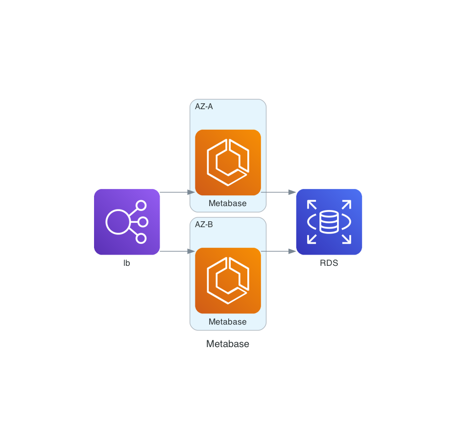

Metabase
========

Projeto com processo de Entraga Continua que provisiona os seguintes items:
- Aplicação Metabase
- Service ECS
- RDS
- AWS VPC
- Cluster ECS rodando sobre EC2

Diagrama:



Direções
--------

O acesso a aplicação pode ser feito no link provido ao fim do processo do GitHub actions na sessão de [Sumario](https://github.com/coolcolden/metabase-cd-aws/actions)


Processo CD
-----------

Commits devem ser feitos em `branches` e abertas PR para branch `main`.
Quando de uma PR aberta, o Terraform irá adicionar a essa PR as mudanças planejadas.
Ao ser feito o `merge` da branch, Terraform será executado novamente, aplicando assim as
mudanças necessárias ao ambiente como definido no IaC.


Acesso a Instância EC2
----------------------

AWS Systems Manager está habilitado nas Instâncias.

```
aws ssm start-session --target i-0b569a00a8cf70dbe
```

Documentação Terraform
======================

<!-- BEGINNING OF PRE-COMMIT-TERRAFORM DOCS HOOK -->
## Requirements

| Name | Version |
|------|---------|
| <a name="requirement_terraform"></a> [terraform](#requirement\_terraform) | >= 1.7 |

## Providers

No providers.

## Modules

| Name | Source | Version |
|------|--------|---------|
| <a name="module_metabase"></a> [metabase](#module\_metabase) | ./modules/ecs_alb | n/a |

## Resources

No resources.

## Inputs

| Name | Description | Type | Default | Required |
|------|-------------|------|---------|:--------:|
| <a name="input_region"></a> [region](#input\_region) | The region where to deploy | `string` | `"sa-east-1"` | no |

## Outputs

| Name | Description |
|------|-------------|
| <a name="output_dns_name"></a> [dns\_name](#output\_dns\_name) | The DNS name of the load balancer |
<!-- END OF PRE-COMMIT-TERRAFORM DOCS HOOK -->
